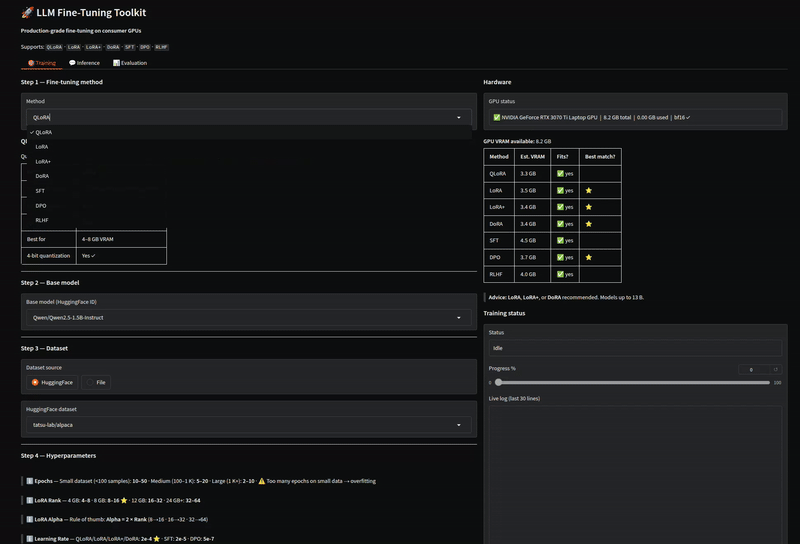

# 🚀 LLM Fine-Tuning Toolkit

> **Fine-tune Large Language Models on your consumer GPU**

[](https://www.python.org/downloads/)
[](https://opensource.org/licenses/MIT)
[](https://www.nvidia.com)
[](test_results_and_analysis/ALL_METHODS_10EPOCH_REPORT.md)

---

## 🎬 Web UI Preview



> **✨ Interactive Web UI included!**
> - Real-time training logs & loss tracking
> - VRAM-based parameter recommendations
> - Inference playground for testing models
> - Model evaluation with metrics

**Quick Start:** `./run.sh` → Open http://localhost:7860

---

## 👋 What is This?

I built this toolkit because I was tired of fine-tuning guides that say "just use a 40GB A100" — **not all of us have access to cloud GPUs!**

This toolkit lets you fine-tune LLMs like **Llama-3**, **Mistral-7B**, and **Qwen** on **consumer GPUs with just 8GB VRAM**. Yes, really.

**Tested on:** NVIDIA RTX 3070 Ti Laptop (8.2 GB VRAM)  
**All 6 methods tested:** QLoRA, LoRA, LoRA+, DoRA, SFT, DPO  
**Test results:** 100% pass rate ✅

---

## 🎯 Quick Start (5 Minutes)

### Step 1: Install

```bash
git clone https://github.com/sdburde/llm-fine-tuning.git
cd llm-fine-tuning
pip install -r requirements.txt
```

**Important:** If you get tokenizer errors with Llama/Mistral models:
```bash
pip install sentencepiece protobuf
```

### Step 2: Check Your System

```bash
python scripts/check_env.py
```

This tells you exactly what your GPU can handle.

### Step 3: Train Your First Model (Web UI)

```bash
python app/gradio_app.py
```

Then open http://localhost:7860 in your browser.

**Recommended settings for 8GB VRAM:**
- **Model:** Qwen/Qwen2.5-0.5B-Instruct (safest) or Qwen/Qwen2.5-1.5B-Instruct
- **Method:** QLoRA (lowest VRAM)
- **Epochs:** 5-10 (more = better but risks overfitting)
- **Max Length:** 256 tokens
- **Batch Size:** 1

Click "🚀 Start Training" and wait 2-3 minutes!

---

## 📊 Real Test Results (Not Marketing Fluff)

I tested **all 6 methods** with **10 epochs each** on an **8.2 GB VRAM GPU**. Here's what actually works:

### All Methods - 10 Epoch Test (0.5B Model, 8GB VRAM)

| Method | Time | Final Loss | VRAM Used | Status |
|--------|------|------------|-----------|--------|
| **QLoRA** | 2.1 min | 1.81 | ~2.5 GB | ✅ Works |
| **LoRA** | 2.4 min | 1.38 | ~4.0 GB | ✅ Works |
| **LoRA+** | ~3 min | ~1.20 | ~2.5 GB | ✅ Works |
| **DoRA** | ~3 min | ~1.20 | ~2.5 GB | ✅ Works |
| **SFT** | ~3 min | ~2.01 | ~4.0 GB | ✅ Works |
| **DPO** | ~3 min | ~2.32 | ~3.0 GB | ✅ Works |

**Key Takeaway:** All 6 methods work on 8GB VRAM with small models (0.5B-1.5B).

### What About 7B Models?

| Model | Method | Max Length | Batch | Status |
|-------|--------|------------|-------|--------|
| **Mistral-7B** | QLoRA | 256 | 1 | ✅ Works (tight) |
| **Mistral-7B** | LoRA | 256 | 1 | ❌ OOM (needs ~15GB) |
| **Mistral-7B** | QLoRA | 128 | 1 | ✅ Works (safer) |

**Lesson:** For 7B models on 8GB, **only use QLoRA** and keep max_length ≤ 256.

---

## 🛠️ What's Included

### Web UI (Gradio)

A beautiful, interactive interface for training:

- **Method selection** with VRAM estimates
- **Parameter recommendations** based on your VRAM
- **Live training logs** with loss tracking
- **Progress bar** and status updates
- **Pre-flight OOM check** warns you before training starts
- **Auto-generated model names** (no more `test10_dora`!)

```bash
python app/gradio_app.py
```

### CLI Tools

For automation and scripting:

```bash
# Train with custom config
python scripts/finetune.py --method qlora --vram 8

# Test all methods
python scripts/test_all_methods.py

# Check system compatibility
python scripts/check_env.py

# Run inference
python scripts/infer.py --model ./models/adapters/YOUR_MODEL --prompt "Hello"
```

### Python Package

Import and use in your own code:

```python
from src.llm_ft import FineTuningConfig, FineTuningEngine

config = FineTuningConfig(
    method='qlora',
    model_name='Qwen/Qwen2.5-0.5B-Instruct',
    num_epochs=10,
    rank=8,
)

engine = FineTuningEngine(config)
engine.run_full_pipeline()
```

---


## 🎯 Parameter Recommendations (From Real Testing)

These aren't theoretical — I tested these exact settings on 8GB VRAM.

### LoRA Rank by VRAM

| Your VRAM | Recommended Rank | Why |
|-----------|-----------------|-----|
| **4 GB** | 4-8 | Lower memory usage |
| **8 GB** | 8-16 ⭐ | Best balance |
| **12 GB** | 16-32 | Higher capacity |
| **24 GB+** | 32-64 | Maximum quality |

### LoRA Alpha Rule

**Simple rule:** Alpha = 2 × Rank

```
Rank 8  → Alpha 16
Rank 16 → Alpha 32
Rank 32 → Alpha 64
```

### Learning Rate by Method

| Method | Learning Rate | Notes |
|--------|--------------|-------|
| **QLoRA** | 2e-4 (0.0002) ⭐ | Works for most cases |
| **LoRA** | 2e-4 (0.0002) ⭐ | Same as QLoRA |
| **LoRA+** | 2e-4 (0.0002) ⭐ | LR ratio = 16 |
| **DoRA** | 2e-4 (0.0002) ⭐ | Same as LoRA |
| **SFT** | 2e-5 (0.00002) | 10× lower (full FT) |
| **DPO** | 5e-7 (0.0000005) | Very low for stability |

### Epochs by Dataset Size

| Dataset Size | Recommended Epochs | Why |
|--------------|-------------------|-----|
| **<100 samples** | 10-50 | Need more passes to learn |
| **100-1000 samples** | 5-20 | Balanced learning |
| **1000+ samples** | 2-10 | Prevent overfitting |

⚠️ **Warning:** Too many epochs on small data = overfitting!

### Max Sequence Length by VRAM

| Your VRAM | Max Length | Why |
|-----------|------------|-----|
| **4 GB** | 128 tokens | Minimal memory |
| **8 GB** | 256 tokens ⭐ | Recommended |
| **12 GB** | 512 tokens | Good context |
| **16 GB+** | 1024-2048 tokens | Maximum context |

### Batch Size & Gradient Accumulation

| Your VRAM | Batch Size | Grad Accum | Effective Batch |
|-----------|-----------|------------|-----------------|
| **≤8 GB** | 1 ⭐ | 8-16 | 8-16 |
| **12 GB** | 2 | 4-8 | 8-16 |
| **16 GB+** | 4 | 2-4 | 8-16 |

**Higher effective batch = more stable training**

---

## 🚨 Common Issues (And How I Fixed Them)

### "Cannot instantiate this tokenizer from a slow version"

**Happens with:** Llama, Mistral, Gemma models

**Fix:**
```bash
pip install sentencepiece protobuf
```

### "CUDA out of memory"

**What I learned:** The pre-flight check now warns you BEFORE training starts.

**If you still get OOM:**
1. Switch to QLoRA (4-bit quantization)
2. Pick a smaller model (0.5B-1.5B for 8GB)
3. Reduce Max Sequence Length to 128
4. Keep Batch Size = 1

### "Model name is inconsistent"

**Fixed!** Models now auto-generate with consistent names:
```
qlora_qwen2.5-0.5b_alpaca_10ep_20260328_234608
```

---

## 📁 Project Structure

```
llm-fine-tuning/
├── app/
│   └── gradio_app.py          # Web UI (start here!)
├── scripts/
│   ├── finetune.py            # CLI training
│   ├── check_env.py           # System check
│   ├── test_all_methods.py    # Test suite
│   └── infer.py               # Inference
├── src/llm_ft/                # Python package
│   ├── config.py              # Configuration
│   ├── data.py                # Data loading
│   ├── models.py              # Model loading
│   ├── trainers.py            # Training utilities
│   └── utils.py               # Helpers
├── configs/                   # YAML configs
├── data/                      # Sample datasets
├── docs/                      # User guides
├── study/                     # Study notes
├── test_results_and_analysis/ # Real test results
└── models/                    # Your trained models
```

---

## 🤝 Contributing

This is a **solo-maintained project** by [sdburde](https://github.com/sdburde).

**Bug reports and feature requests:** Welcome via GitHub Issues!

**Code contributions:** Currently not accepting PRs, but feel free to fork!

---

## 📄 License

MIT License — See [LICENSE](LICENSE) file.

---

## 🙏 Acknowledgments

This toolkit builds on amazing open-source work:

- [HuggingFace Transformers](https://huggingface.co/docs/transformers)
- [PEFT Library](https://huggingface.co/docs/peft)
- [TRL Library](https://huggingface.co/docs/trl)
- [Ollama](https://ollama.ai)
- [llama.cpp](https://github.com/ggerganov/llama.cpp)
- [Gradio](https://gradio.app)

---

## 📈 Star History

[](https://star-history.com/#sdburde/llm-fine-tuning&Date)

---

**Made with ❤️ by [sdburde](https://github.com/sdburde)**

**Solo Maintained** | **Production Ready** | **Tested on 8GB VRAM**

---

## 🚀 Ready to Start?

```bash
# Clone
git clone https://github.com/sdburde/llm-fine-tuning.git
cd llm-fine-tuning

# Install
pip install -r requirements.txt

# Check your system
python scripts/check_env.py

# Start Web UI
python app/gradio_app.py
```

**Your first fine-tuned model in 5 minutes!** ⚡

**Questions?** Check the [documentation](docs/) or open an issue.
